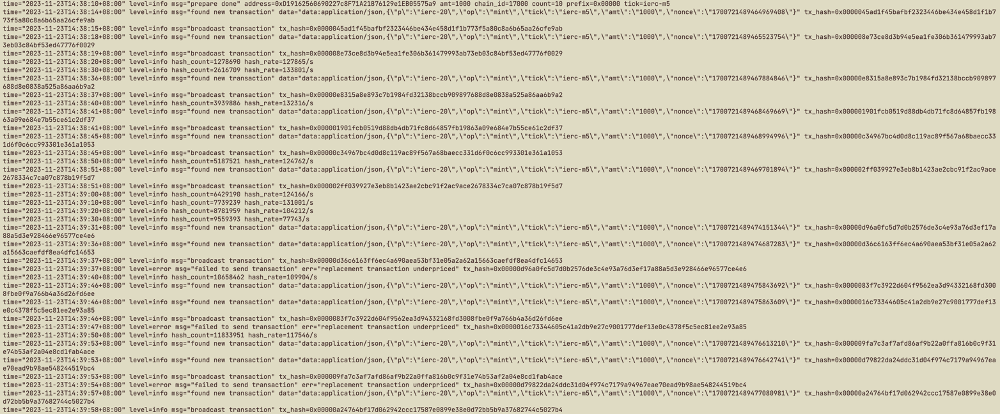

# rETH 多核挖矿程序

原作者的推特
[联系作者](https://twitter.com/chenmin22998595)

我的推特，只是稍微改了一下，不会golang
[联系作者](https://twitter.com/123xzr)

算力我的i7-13700k大概3500000hash/s


测试地址

https://holesky.etherscan.io/address/0xd19162560690227c8f71a21b76129e1eb05575a9


### 使用方式

1. 克隆库

2. 修改目录下的config.txt文件,改成你自己的配置

3. 愉快的学习运行方法吧

```toml
# 你的私钥 带0x前缀
# 你要改这个
private_key = "0x440d58ea9c07ab873295a71f24d41f58776b3732000643178dd351c991b53e48"
# rpc  主网: https://1rpc.io/eth  holesky测试网: https://1rpc.io/holesky
# 你可以不改这个
rpc = "https://1rpc.io/eth"
# token
# 你要改这个
tick = "ierc-m5"
# 数量
# 你要改这个
amt = 1000
# 难度
# 你要改这个
prefix = "0x00000"
# mint数量
# 你要改这个
count = 10
# gas优先费用
# 你可以不改这个
gas_tip = 3
# 最大gas费用
# 你可以不改这个 这个值必须要比ethgas高
gas_max = 50
```

注意: 
1. 先1张测试成功后再加数量, 或者使用其他gas低的链rpc先测试使用
2. 有时因为算力过高或者难度过低,会连续挖到两个,两笔交易在同一区块内打包时,官方只会认第一个,因此有时会打到无效的,如介意gas损失可以把count设置为1,一次一次打
